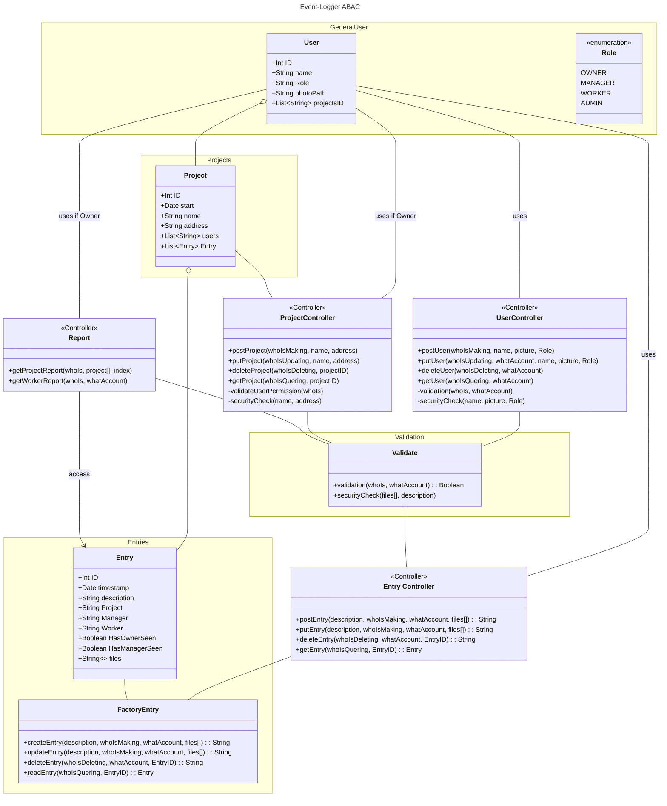

# hands-on-backend
 backend for the project Events Logger

## Project Structure v0.1
this is the inicial project structure, it may receive necessary changes.
You can see in full page [here](https://mermaid.live/view#pako:eNqtV21vGjkQ_iuWpUpBB9ERoAkIRaIh10NXkjRRL9KVfvDtGvBlsVe2Ny2HyG_v2GvYXa_Ji9T9wuKZeTwvz4y9GxyJmOIBbrVaM66ZTugAXT5SrlufxGJBJRp9GF3MuBVHCVFqzMhCktWMI3jevUMxkzTSTPB8xTxfFNiJVgvdSPEfCAtJ8eZEqNC6EFxLkSRUekghFTRAmaIKsTm6_s7LJn-ThMVEU2NW6F_Cy3rG68ieisMt9CDCKeFk4SK6_hfsHvd4Ja2KxCD_QSIt5NrTfEHsu3NQcee_-a2lpRzoLU2FtHneZaZWhJJ9UM3bI6gDGXAuiaLsAS_O0S7PJIqoUsho1Wlhcn0gYgdVI0ABZHnqp_LrDOc7l3iGv20K_OGwkJyfF-u_pUJpa3oUUxVJlhq2N9H3pZioKXlgfGH-ED2KIpFx3URzllD19VsDfLzTEuRlsOzXYcU0oZrmcBZhbBbqGFZjMg5iLKguAXzOqLT2JZNSGba7DHOyoiolEbVSRtWmwoS8AJWOqCrYrbnQbL4-alQk2zIbcpxyA5RgLEYkKdml4I0ZrSfDImZp_IsR31qmAzAQafxcqQZ-w2z9RAYzOOEaTcbe4tgMUM2gyJqsUk-Ye4dKyQkr1KZ_WeiGalh4L-RDTfZBiIQSjv4kynb8HaX8sIrDDyjlewzP87JV0nWQ5W7eQaib8ojZnzV-Uh_3-nmxKpU2TeU89cwUjTLJ9PpiSaOHI0erZjnTjVp5A95-pJAekpiBufE5cAv7-u4Oh5RnKzAxO5RHn3mu768ub6tL09HV6KO_eH99-5e_NhpPJ1fPENLz8DAfHS9MiGGJCSssSZdCixuil574E1P6Kdd5QmlOVeVvHGZHVVqEUpwfrz1WjNVRZbCYEJsoZZHOJLyYuBrV46Ow-WJGVX2OvACRj6MCJTiNGtUjotDej52wcut55pcUq1wP-1yjjuOwvQG8JsfguptCuc3OJ1dv01yMx_SHF24-f6om9TC2ft-5rVSt6Zzg9aMXxq7Ub-0BEscSblTP8RyuTDKoYI-GpwMnSCX5tTvja7nuDEN0d557RK8YFFw_aJITu2JVcNtVHM7JID08coe0d9S2rXND5Yoptaf5S8yuurvN76pw3YE7EEVzIb3PhxnWSwaXW4UImmemJxBdEZagOVx34N8M4yaGiQ1rMXy82RIYGwrcwAN4jYl8mOEZ34IeybS4W_MID-YkUbSJ8yuO-5Dbr6aE48EG_8CDTrt73Ou2O712p33W6fW7TbzGg277-Ox9p3_SP-2e9UDWe79t4v-FAITfj_unJ-2TfrfdP223T-DHwv1jhVpmgE5jBpe4af6xab85tz8BfI1rBQ)

